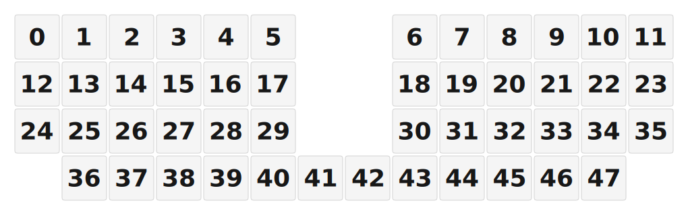

# ZMK Configuration for Naked48

*Generated by Shield Wizard for ZMK*



Download compiled firmware from the Actions tab. <https://zmk.dev/docs/user-setup#installing-the-firmware>

Edit your keymap <https://zmk.dev/docs/keymaps>.
User keymap is located at [`config/naked48.keymap`](config/naked48.keymap).

-----

<details>
<summary>
Shield Wizard Debug Information
</summary>

In case of broken configuration, here is the Shield Wizard internal data used to generate this configuration:

Commit: 1bc308cbed65fac144201644c2075be718bdbf1f

```json
{"name":"Naked48","shield":"naked48","dongle":false,"modules":[],"layout":[{"id":"01KKPCF6522FDZSSSETV9FVT8V","part":0,"row":0,"col":0,"w":1,"h":1,"x":0,"y":0,"r":0,"rx":0,"ry":0},{"id":"01KKPCF652YP8NXK2EAMPY6SX8","part":0,"row":0,"col":1,"w":1,"h":1,"x":1,"y":0,"r":0,"rx":0,"ry":0},{"id":"01KKPCF652WE4W3M814XHBTDZ8","part":0,"row":0,"col":2,"w":1,"h":1,"x":2,"y":0,"r":0,"rx":0,"ry":0},{"id":"01KKPCF652BR2K1SHWWV18Y62X","part":0,"row":0,"col":3,"w":1,"h":1,"x":3,"y":0,"r":0,"rx":0,"ry":0},{"id":"01KKPCF6529BQ755C6K40ZH04X","part":0,"row":0,"col":4,"w":1,"h":1,"x":4,"y":0,"r":0,"rx":0,"ry":0},{"id":"01KKPCF6528P77FDYCSXGYYK6G","part":0,"row":0,"col":5,"w":1,"h":1,"x":5,"y":0,"r":0,"rx":0,"ry":0},{"id":"01KKPCF6527FR5HGPK385M40BY","part":0,"row":0,"col":8,"w":1,"h":1,"x":8,"y":0,"r":0,"rx":0,"ry":0},{"id":"01KKPCF652B7WFZ9W36K4G8H7N","part":0,"row":0,"col":9,"w":1,"h":1,"x":9,"y":0,"r":0,"rx":0,"ry":0},{"id":"01KKPCF652ZZSJ3GXNRJVFN3YF","part":0,"row":0,"col":10,"w":1,"h":1,"x":10,"y":0,"r":0,"rx":0,"ry":0},{"id":"01KKPCF65221HP8500BQNHV42A","part":0,"row":0,"col":11,"w":1,"h":1,"x":11,"y":0,"r":0,"rx":0,"ry":0},{"id":"01KKPCF652VNF27WSF3AJ3W52V","part":0,"row":0,"col":12,"w":1,"h":1,"x":12,"y":0,"r":0,"rx":0,"ry":0},{"id":"01KKPCF652R09MRHDZWNG3JVXT","part":0,"row":0,"col":13,"w":1,"h":1,"x":13,"y":0,"r":0,"rx":0,"ry":0},{"id":"01KKPCF652Y75BETABMRJ6BC2A","part":0,"row":1,"col":0,"w":1,"h":1,"x":0,"y":1,"r":0,"rx":0,"ry":0},{"id":"01KKPCF652DATRNA3YX0QKYAAN","part":0,"row":1,"col":1,"w":1,"h":1,"x":1,"y":1,"r":0,"rx":0,"ry":0},{"id":"01KKPCF652DYKHA115B0YY36VQ","part":0,"row":1,"col":2,"w":1,"h":1,"x":2,"y":1,"r":0,"rx":0,"ry":0},{"id":"01KKPCF652WNG8K6913YKXT4J6","part":0,"row":1,"col":3,"w":1,"h":1,"x":3,"y":1,"r":0,"rx":0,"ry":0},{"id":"01KKPCF652ZGHPCXQ32K0C9ANW","part":0,"row":1,"col":4,"w":1,"h":1,"x":4,"y":1,"r":0,"rx":0,"ry":0},{"id":"01KKPCF6528GVZTQ9MVTQX5ZEP","part":0,"row":1,"col":5,"w":1,"h":1,"x":5,"y":1,"r":0,"rx":0,"ry":0},{"id":"01KKPCF652MBKB5DYCC9B2AM6B","part":0,"row":1,"col":8,"w":1,"h":1,"x":8,"y":1,"r":0,"rx":0,"ry":0},{"id":"01KKPCF6529PCKZW8K9AKF23JF","part":0,"row":1,"col":9,"w":1,"h":1,"x":9,"y":1,"r":0,"rx":0,"ry":0},{"id":"01KKPCF652AQDPSP58S9AWTEXT","part":0,"row":1,"col":10,"w":1,"h":1,"x":10,"y":1,"r":0,"rx":0,"ry":0},{"id":"01KKPCF652VTNJWD0JCHYBSMYC","part":0,"row":1,"col":11,"w":1,"h":1,"x":11,"y":1,"r":0,"rx":0,"ry":0},{"id":"01KKPCF6529S678HQWGENM25RX","part":0,"row":1,"col":12,"w":1,"h":1,"x":12,"y":1,"r":0,"rx":0,"ry":0},{"id":"01KKPCF6528WAC26MSW77DDDEG","part":0,"row":1,"col":13,"w":1,"h":1,"x":13,"y":1,"r":0,"rx":0,"ry":0},{"id":"01KKPCF652YR18EDAK1G6X86JG","part":0,"row":2,"col":0,"w":1,"h":1,"x":0,"y":2,"r":0,"rx":0,"ry":0},{"id":"01KKPCF652V2ZC2CBGC005P7ET","part":0,"row":2,"col":1,"w":1,"h":1,"x":1,"y":2,"r":0,"rx":0,"ry":0},{"id":"01KKPCF65220CYY9HQXNK2YCFC","part":0,"row":2,"col":2,"w":1,"h":1,"x":2,"y":2,"r":0,"rx":0,"ry":0},{"id":"01KKPCF652TPHF6B9R01GJNPFN","part":0,"row":2,"col":3,"w":1,"h":1,"x":3,"y":2,"r":0,"rx":0,"ry":0},{"id":"01KKPCF6520B48A3H247C069YQ","part":0,"row":2,"col":4,"w":1,"h":1,"x":4,"y":2,"r":0,"rx":0,"ry":0},{"id":"01KKPCF652PFRY9BM1G3FNZP81","part":0,"row":2,"col":5,"w":1,"h":1,"x":5,"y":2,"r":0,"rx":0,"ry":0},{"id":"01KKPCF652292A7P9YPTRHZ3DD","part":0,"row":2,"col":8,"w":1,"h":1,"x":8,"y":2,"r":0,"rx":0,"ry":0},{"id":"01KKPCF652GX7EJ66PVRFZ0G6Y","part":0,"row":2,"col":9,"w":1,"h":1,"x":9,"y":2,"r":0,"rx":0,"ry":0},{"id":"01KKPCF652S7896CATZHSQJ0Y1","part":0,"row":2,"col":10,"w":1,"h":1,"x":10,"y":2,"r":0,"rx":0,"ry":0},{"id":"01KKPCF65225N6A7C3HD0Y2DGX","part":0,"row":2,"col":11,"w":1,"h":1,"x":11,"y":2,"r":0,"rx":0,"ry":0},{"id":"01KKPCF6523F4172DKBJ390FQP","part":0,"row":2,"col":12,"w":1,"h":1,"x":12,"y":2,"r":0,"rx":0,"ry":0},{"id":"01KKPCF652Z8M2S5WRHG78T1PX","part":0,"row":2,"col":13,"w":1,"h":1,"x":13,"y":2,"r":0,"rx":0,"ry":0},{"id":"01KKPCF65299V26REFBJT7XTW2","part":0,"row":3,"col":1,"w":1,"h":1,"x":1,"y":3,"r":0,"rx":0,"ry":0},{"id":"01KKPCF6522G8VW2DNRSFQF4MM","part":0,"row":3,"col":2,"w":1,"h":1,"x":2,"y":3,"r":0,"rx":0,"ry":0},{"id":"01KKPCF652R9M530M74T0ZNWC8","part":0,"row":3,"col":3,"w":1,"h":1,"x":3,"y":3,"r":0,"rx":0,"ry":0},{"id":"01KKPCF652FF6P4D84QAH2TGKQ","part":0,"row":3,"col":4,"w":1,"h":1,"x":4,"y":3,"r":0,"rx":0,"ry":0},{"id":"01KKPCF652V9WWPPKE3QYX715A","part":0,"row":3,"col":5,"w":1,"h":1,"x":5,"y":3,"r":0,"rx":0,"ry":0},{"id":"01KKPCF6527HKSEZPWGCCRKE3R","part":0,"row":3,"col":6,"w":1,"h":1,"x":6,"y":3,"r":0,"rx":0,"ry":0},{"id":"01KKPCF652WB67KNNXP8GMM7XC","part":0,"row":3,"col":7,"w":1,"h":1,"x":7,"y":3,"r":0,"rx":0,"ry":0},{"id":"01KKPCF652VB8NTAG5C02GBCM4","part":0,"row":3,"col":8,"w":1,"h":1,"x":8,"y":3,"r":0,"rx":0,"ry":0},{"id":"01KKPCF652PMCNBFYSDX4MV2SQ","part":0,"row":3,"col":9,"w":1,"h":1,"x":9,"y":3,"r":0,"rx":0,"ry":0},{"id":"01KKPCF652PWB9TB2X8Z9KNTB0","part":0,"row":3,"col":10,"w":1,"h":1,"x":10,"y":3,"r":0,"rx":0,"ry":0},{"id":"01KKPCF6527AY5YD2BRA5MW53V","part":0,"row":3,"col":11,"w":1,"h":1,"x":11,"y":3,"r":0,"rx":0,"ry":0},{"id":"01KKPCF652ZZ3TNJ61AEF2BNYT","part":0,"row":3,"col":12,"w":1,"h":1,"x":12,"y":3,"r":0,"rx":0,"ry":0}],"parts":[{"name":"unibody","controller":"nice_nano_v2","wiring":"matrix_diode","keys":{"01KKPCF6522FDZSSSETV9FVT8V":{"output":"d2","input":"d21"},"01KKPCF652YP8NXK2EAMPY6SX8":{"output":"d2","input":"d20"},"01KKPCF652WE4W3M814XHBTDZ8":{"output":"d2","input":"d19"},"01KKPCF652BR2K1SHWWV18Y62X":{"output":"d2","input":"d18"},"01KKPCF6529BQ755C6K40ZH04X":{"output":"d2","input":"d15"},"01KKPCF6528P77FDYCSXGYYK6G":{"output":"d2","input":"d14"},"01KKPCF6527FR5HGPK385M40BY":{"output":"d2","input":"d16"},"01KKPCF652B7WFZ9W36K4G8H7N":{"output":"d2","input":"d10"},"01KKPCF652ZZSJ3GXNRJVFN3YF":{"output":"d2","input":"d6"},"01KKPCF65221HP8500BQNHV42A":{"output":"d2","input":"d7"},"01KKPCF652VNF27WSF3AJ3W52V":{"output":"d2","input":"d8"},"01KKPCF652R09MRHDZWNG3JVXT":{"output":"d2","input":"d9"},"01KKPCF652Y75BETABMRJ6BC2A":{"output":"d3","input":"d21"},"01KKPCF652DATRNA3YX0QKYAAN":{"output":"d3","input":"d20"},"01KKPCF652DYKHA115B0YY36VQ":{"output":"d3","input":"d19"},"01KKPCF652WNG8K6913YKXT4J6":{"output":"d3","input":"d18"},"01KKPCF652ZGHPCXQ32K0C9ANW":{"output":"d3","input":"d15"},"01KKPCF6528GVZTQ9MVTQX5ZEP":{"output":"d3","input":"d14"},"01KKPCF652MBKB5DYCC9B2AM6B":{"output":"d3","input":"d16"},"01KKPCF6529PCKZW8K9AKF23JF":{"output":"d3","input":"d10"},"01KKPCF652AQDPSP58S9AWTEXT":{"output":"d3","input":"d6"},"01KKPCF652VTNJWD0JCHYBSMYC":{"output":"d3","input":"d7"},"01KKPCF6529S678HQWGENM25RX":{"output":"d3","input":"d8"},"01KKPCF6528WAC26MSW77DDDEG":{"output":"d3","input":"d9"},"01KKPCF652YR18EDAK1G6X86JG":{"output":"d4","input":"d21"},"01KKPCF652V2ZC2CBGC005P7ET":{"output":"d4","input":"d20"},"01KKPCF65220CYY9HQXNK2YCFC":{"output":"d4","input":"d19"},"01KKPCF652TPHF6B9R01GJNPFN":{"output":"d4","input":"d18"},"01KKPCF6520B48A3H247C069YQ":{"output":"d4","input":"d15"},"01KKPCF652PFRY9BM1G3FNZP81":{"output":"d4","input":"d14"},"01KKPCF652292A7P9YPTRHZ3DD":{"output":"d4","input":"d16"},"01KKPCF652GX7EJ66PVRFZ0G6Y":{"output":"d4","input":"d10"},"01KKPCF652S7896CATZHSQJ0Y1":{"output":"d4","input":"d6"},"01KKPCF65225N6A7C3HD0Y2DGX":{"output":"d4","input":"d7"},"01KKPCF6523F4172DKBJ390FQP":{"output":"d4","input":"d8"},"01KKPCF652Z8M2S5WRHG78T1PX":{"output":"d4","input":"d9"},"01KKPCF65299V26REFBJT7XTW2":{"output":"d5","input":"d21"},"01KKPCF6522G8VW2DNRSFQF4MM":{"output":"d5","input":"d20"},"01KKPCF652R9M530M74T0ZNWC8":{"output":"d5","input":"d19"},"01KKPCF652FF6P4D84QAH2TGKQ":{"output":"d5","input":"d18"},"01KKPCF652V9WWPPKE3QYX715A":{"output":"d5","input":"d15"},"01KKPCF6527HKSEZPWGCCRKE3R":{"output":"d5","input":"d14"},"01KKPCF652WB67KNNXP8GMM7XC":{"output":"d5","input":"d16"},"01KKPCF652VB8NTAG5C02GBCM4":{"output":"d5","input":"d10"},"01KKPCF652PMCNBFYSDX4MV2SQ":{"output":"d5","input":"d6"},"01KKPCF652PWB9TB2X8Z9KNTB0":{"output":"d5","input":"d7"},"01KKPCF6527AY5YD2BRA5MW53V":{"output":"d5","input":"d8"},"01KKPCF652ZZ3TNJ61AEF2BNYT":{"output":"d5","input":"d9"}},"encoders":[],"pins":{"d15":"input","d14":"input","d16":"input","d10":"input","d6":"input","d7":"input","d8":"input","d9":"input","d2":"output","d3":"output","d4":"output","d5":"output","d21":"input","d20":"input","d19":"input","d18":"input"},"buses":[{"type":"spi","name":"spi0","devices":[]},{"type":"spi","name":"spi1","devices":[]},{"type":"spi","name":"spi2","devices":[]},{"type":"spi","name":"spi3","devices":[]},{"type":"i2c","name":"i2c0","devices":[]},{"type":"i2c","name":"i2c1","devices":[]}]}]}
```

</details>
